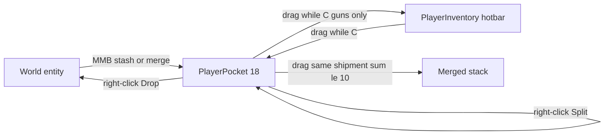

# S&Box C-Menu Pocket Inventory

RP pocket storage shown while holding **C** (`inspectmenu` → `ContextMenuHost`).
Separate from the weapon hotbar (`PlayerInventory`). Match toolbar HUD chrome —
read [sbox-player-toolbar-hud](../sbox-player-toolbar-hud/SKILL.md) for slot
visuals, sway, and theme tokens.

## Product rules (do not break)

| Rule | Detail |
|------|--------|
| Capacity | **18 slots** — **2 rows × 9** (same width as 9-slot hotbar) |
| Visibility | Only while inspect menu is open (`SpawnMenuHost` open + active mode is `ContextMenuHost`) |
| Placement | Inside `Inventory.razor` **`.slot-stack`** above `.hotbar` (same column). Presets button is a **sibling** of `.slot-stack`, not of `.pocket` |
| Store | RP-value only: **money printers**, **firearms**, **gun shipments** |
| Never store | Props, wire entities, **permanent tools** (Hands / Keys / Physgun / Toolgun), melee job weapons, camera/medkit/spawner |
| Permanent tools | Blocked from pocket via `Pocketable.IsPermanentTool` / `IsRpGun` — **do not** `IsJobLocked` them just to keep them out of pocket; they must stay rearrangable on the hotbar |
| World → pocket | **MMB** (`attack3`): printers, owned shipments (stash or merge), guns |
| Pocket → world | **Right-click** pocket slot → MenuPanel **Drop** (never drag-to-world) |
| Hotbar ↔ pocket | **Drag** while C is held; printers/shipments cannot go on the hotbar |
| Hotbar → world | Still allowed via drag when **not** in inspect mode; blocked while C is held. Permanent tools reject world drop/remove |
| Ownership | `Ownable.HasProtectedAccess` — own items (or admin); no Ownable → allowed |
| Authority | Host-only mutations; client calls Rpc.Host wrappers (`Rpc.Caller == Network.Owner`). MMB pickup re-traces on host. |
| Networking | After stash/drop/reparent call `Network.Refresh()`. Slot contents also sync via `PlayerPocket.SlotObjectIds` (player is pre-spawn) because late-added `PocketedItem` Sync is unreliable |
| Death | Host drops all pocket slots into the world |
| Shipment stack | **Max 10** (`WeaponShipment.MaxStackSize`). Same-weapon shipments merge only if **sum ≤ 10** (all-or-nothing; no partial fill) |
| Binds | **E** = Use only (collect / dispense / hotbar equip). **MMB** = pocket. Doors keep MMB for the owner radial |

## Key files

| Area | Path |
|------|------|
| Pocket component | `DarkRP2/Code/Player/PlayerPocket.cs` |
| Slot marker / names | `DarkRP2/Code/Player/PocketedItem.cs` |
| Pocketable rules | `DarkRP2/Code/Player/Pocketable.cs` |
| Shipment entity | `DarkRP2/Code/Items/WeaponShipment.cs` |
| Shipment shop catalog | `DarkRP2/Code/Economy/Weapons/WeaponShipmentCatalog.cs` |
| Buy RPC | `DarkRP2/Code/Player/Player.WeaponShipments.cs` |
| Prefab | `DarkRP2/Assets/entities/shipment/weapon_shipment.prefab` |
| E world pickup | `DroppedWeapon.cs`, `MoneyPrinter.cs`, `WeaponShipment.cs` (`IPressable` Use only) |
| MMB world pocket | `PlayerPocket.HandleWorldPickupInput` (from `Player.OnControl`) |
| Hotbar filter | `DarkRP2/Code/Player/PlayerInventory.cs` (`Weapons` excludes `PocketedItem`) |
| HUD host | `DarkRP2/Code/UI/Inventory/Inventory.razor` (+ `.scss`) |
| Pocket slot UI | `DarkRP2/Code/UI/Inventory/PocketSlot.razor` (+ `.scss`) |
| Hotbar drag bridge | `DarkRP2/Code/UI/Inventory/InventorySlot.razor` |
| Player setup | `DarkRP2/Assets/prefabs/engine/player.prefab` → `PlayerPocket` (`MaxSlots: 18`) |

## Architecture



```
Inventory root (HudSway)
└── .hotbar-row          row, align flex-end
    ├── .slot-stack      column, stretch — pocket + hotbar share width
    │   ├── .pocket      2×9 (inspect only)
    │   └── .hotbar      1×9
    └── HotbarPresetsButton
```

- **Never** put `.pocket` as a centered sibling of `.hotbar-row`. The presets button widens the row; a separate centered pocket will misalign.
- Pocketed entities are **reparented** under the player, `Enabled = false`, tagged with `PocketedItem.Slot`.
- Guns keep `BaseCarryable` but `InventorySlot = -1` and `PocketedItem` so they leave the hotbar.
- `PlayerInventory.Weapons` **must** filter out `PocketedItem` or pocket guns pollute the hotbar.
- Pocketed roots are **disabled** — always `GetComponent<T>( true )` / `GetComponentsInChildren(..., true )` when reading printers/shipments/weapons from a pocket slot.

## Pocketable detection

Use `Pocketable.IsPocketable` / `ResolveRoot` / `IsRpGun` / `IsPermanentTool` — do not invent parallel checks.

```csharp
// Hands / Keys / Physgun / Toolgun — never enter pocket; still rearrangable on hotbar
Pocketable.IsPermanentTool( carryable );

// Guns: BaseWeapon, not job-locked, not permanent tool / Spawner,
// not MeleeWeapon, not Camera/Medkit/ScreenWeapon
Pocketable.IsRpGun( carryable );

// World hit → networked root that should be stashed
Pocketable.ResolveRoot( hitGameObject );
```

- `IsRpGun` already rejects permanent tools — use it in `MoveFromHotbar` / `MoveToHotbar` / `PocketSlot.OnDrop`.
- Do **not** set `IsJobLocked = true` on Hands/Keys/Physgun/Toolgun in `GiveDefaultWeapons` to enforce pocket rules; that locks hotbar rearrange. Job loadout weapons still use `IsJobLocked`.

## Weapon shipments

### Identity & titles

- Stack identity = same `WeaponPrefabPath` (case-insensitive), via `WeaponShipment.IsSameStackAs` / `CanStackWith`.
- Catalog / `ShipmentTitle` uses the **weapon name only** (`USP`, `SMG`, `M4A1`, …) — **never** suffix `"Shipment"` (quantity already implies a stack). Match `WeaponShopCatalog` titles.
- Shop section remains titled `"Shipments"`; item rows use the short weapon title + `ShipmentCount x weapons` meta.
- Spawn clamps count: `Math.Clamp( definition.WeaponsPerShipment, 1, MaxStackSize )`.
- Catalog `WeaponsPerShipment` should use `WeaponShipment.MaxStackSize` (10).

### Display strings

| Surface | Format | Source |
|---------|--------|--------|
| Pocket slot name | `USP (10)` | `PocketedItem.GetDisplayName()` → `$"{ShipmentTitle} ({RemainingWeapons})"` |
| World crate `TextRenderer` | `USP (10)` | `WeaponShipment.RefreshLabels()` |
| Use tooltip description | `USP - 10 left` | `IPressable.GetTooltip` |
| Fallback if title empty | `Shipment (N)` | pocket display only |

### Stack / merge (max 10)

`WeaponShipment.MaxStackSize = 10`. Counts above max are clamped on change / stash.

| Action | Behavior |
|--------|----------|
| Pocket drag A → B (same weapon) | Merge into B if `A.Remaining + B.Remaining ≤ 10`; destroy A. Else **swap** slots |
| MMB world pickup | Prefer `TryMergeWorldShipment` into an existing pocket stack when sum ≤ 10; else stash into empty slot |
| Pocket full | MMB still allowed when `CanMergeShipment( go )` is true (`WeaponShipment.CanPocket` checks this) |
| Partial merge | **Not allowed** — e.g. 6+5 fails; 6+4 succeeds → 10 |
| Individual guns | Do **not** auto-stack into shipments; only shipment↔shipment |

Helpers live on `WeaponShipment` (`CanStackWith`) and `PlayerPocket` (`CanMergeShipment`, `TryMergePocketShipments`, `TryMergeWorldShipment`).

### Split

Right-click a pocketed shipment with `RemainingWeapons > 1`:

- **Split in Half** → `SplitShipment( slot, Remaining / 2 )`
- **Split One** → `SplitShipment( slot, 1 )`
- Then spacer + **Drop**

`SplitShipment` clones a new shipment prefab into an empty pocket slot, copies `WeaponPrefabPath` / `ShipmentTitle`, sets amount, decrements source. Rejects if amount ≥ source count, amount > max, or pocket full.

### Dispense vs pocket (world)

- **E** → always **dispenses** one weapon pickup when `RemainingWeapons > 0`
- **MMB** → pocket/merge when owner has access and (empty slot **or** mergeable)
- Empty crates destroy themselves when count hits 0 (host)

## Binds — Use vs Pocket

| Input | Action |
|-------|--------|
| **E** (`IPressable`) | Use only: collect printer money, dispense shipment weapon, equip gun to hotbar |
| **MMB** (`attack3`) | Pocket looked-at pocketable via `PlayerPocket.HandleWorldPickupInput` |
| Door MMB | Owner radial still wins when looking at a manage-able door (radial consumes first) |
| Toolgun MMB | `ToolAuto` skips when the look target resolves to a pocketable |

### Per-type E / MMB

- **DroppedWeapon**: E → hotbar when `CanTake`; hotbar full → notice (no pocket). MMB → pocket if RP gun + access + room
- **MoneyPrinter**: E → Collect when `StoredMoney > 0` only (never pockets). MMB → pocket (owner access), even with money stored
- **WeaponShipment**: E → dispense. MMB → pocket/merge when owner has access
- Never use Hands punch / attack for pocketing

Wire MMB after door radial in `Player.OnControl`:

```csharp
HandleDoorRadialInput();
GetComponent<PlayerPocket>()?.HandleWorldPickupInput();
```

`DoorRadialMenu.TryHandleInput` must **only** `Input.Clear("attack3")` when it actually opens/closes/notices a door — never swallow MMB on printers.

## PlayerPocket API (host)

| Method | Purpose |
|--------|---------|
| `TryPickup(GameObject)` | World → merge shipment if possible, else empty pocket slot |
| `CanMergeShipment(GameObject)` | True when incoming shipment can fully merge into an existing stack |
| `Drop(int slot)` | Pocket → world in front of player |
| `SplitShipment(slot, amount)` | Split count from pocketed shipment into a new pocket slot |
| `MoveSlot(from, to)` | Merge same shipments if sum ≤ 10; else reorder / swap |
| `MoveFromHotbar(hotbar, pocket)` | Hotbar gun → pocket (swap if pocket holds a gun) |
| `MoveToHotbar(pocket, hotbar)` | Pocket gun → hotbar (reject printers/shipments) |

Swap order matters: clear source slot **before** writing the other item into the same index (avoid two `PocketedItem`s sharing one `Slot`).

Capture display names **before** destroying a merged world object (pickup notice runs after `root.Destroy()`).

## UI conventions

- Reuse hotbar slot sizes (`64×72`), absolute icon/divider/name layout, `.selection` frame (not `box-shadow`)
- Same white L-corner arms on `.pocket` as `.hotbar`; `overflow: visible`
- Pocket host: `pointer-events: all` while visible; Inventory root stays `pointer-events: none`
- Inspect detection:

```csharp
IsSpawnMenuOpen() && SpawnMenuHost.GetActiveMode() is ContextMenuHost
```

- `HudSway.Apply` on Inventory root; bake spawn-menu `translateY(24px)` via `extraOffset` (never CSS transform on swayed root)
- Printers without a texture: Material fallback icon (`print`) via `.fallback-icon`
- Shipments: prefer weapon prefab `DisplayIcon`; fallback icon `inventory_2`
- Pocket guns use class `no-tint` (same idea as colored thumbs — pocket weapons keep natural icon path handling)
- Right-click: `MenuPanel.Open(this)` → Split options (shipments) + **Drop**
- `BuildHash` must include pocket item identities **and** `GetDisplayName()` so Razor rebuilds on stash/drop/stack count changes
- Set `NamePanel.Text` / icon background in `Tick` (dynamic labels)

### Razor pitfall (PocketSlot)

Do **not** nest `@{ ... }` inside `@if { ... }` — Razor error **RZ1010** breaks the whole `darkrp2` build.

```razor
@{
    var item = GetItem();
    var iconPath = item.IsValid() ? item.GetIconPath() : null;
}

@if ( item.IsValid() )
{
    @if ( !string.IsNullOrEmpty( iconPath ) )
    {
        <div class="icon" @ref="IconPanel"></div>
    }
    else
    {
        <div class="fallback-icon"><i>@item.GetFallbackIcon()</i></div>
    }
    ...
}
```

### Cross-panel API access

- `InventorySlot.GetWeapon()` is **private** — `PocketSlot` must not call it (compile error: inaccessible).
- From `PocketSlot`, read hotbar weapons via `hotbarSlot.Inventory?.GetSlot( hotbarSlot.Index )`.

## Drag / drop checklist

- [ ] `PocketSlot` ↔ `PocketSlot` → `MoveSlot` (merge same shipments when sum ≤ 10, else swap)
- [ ] `InventorySlot` → `PocketSlot` → `MoveFromHotbar` only if `IsRpGun`
- [ ] `PocketSlot` → `InventorySlot` → `MoveToHotbar`
- [ ] Permanent tools (Hands/Keys/Physgun/Toolgun): rearrangable on hotbar; rejected by pocket drop / `MoveFromHotbar`
- [ ] Inspect open + hotbar `OnDragEnd` with no target → **do not** `Inventory.Drop`
- [ ] Pocket `OnDragEnd` → never world-drop
- [ ] Job-locked hotbar items: `WantsDrag` false; reject in move APIs (job weapons only — not permanent tools)
- [ ] Set `DragData.Handled = true` when a slot consumes the drag
- [ ] Cross-panel drag: `InventorySlot.OnDragEnd` must preserve `UserData` when `PocketSlot.HasDragHover` (and vice versa) — otherwise `OnDrop` sees null data

## Extending pocketable types

1. Add detection in `Pocketable.IsPocketable` / display helpers on `PocketedItem`
2. Keep host validation in `TryPickup` / move APIs
3. Decide hotbar eligibility (almost always **no** for non-guns)
4. Ensure disabled-in-pocket behavior is correct (no printing, no dispense, etc.)
5. If stackable: define max stack, same-identity check, merge on `MoveSlot` / `TryPickup`, clamp on stash
6. Update this skill’s product table

## Checklist for changes

- [ ] Still 2×9 in `.slot-stack` above hotbar; left/right edges match hotbar
- [ ] Presets button remains beside `.slot-stack`, not between pocket and hotbar
- [ ] Props/wire/permanent tools still excluded from pocket
- [ ] Permanent tools still rearrangable on hotbar (not falsely job-locked)
- [ ] MMB world pocket/merge; E Use only; right-click drop/split; C-drag hotbar↔pocket
- [ ] Shipment titles are weapon-only; labels `Title (Qty)`; max stack 10; merge only when sum ≤ 10
- [ ] Pocketed component reads use `includeDisabled: true`
- [ ] `PocketSlot.razor` has no nested `@{` inside `@if` (RZ1010)
- [ ] `Weapons` still excludes `PocketedItem`
- [ ] `PlayerPocket` present on player prefab
- [ ] Server validates ownership and slot bounds
- [ ] Restart session after adding/removing `PlayerPocket` if hotload fails
