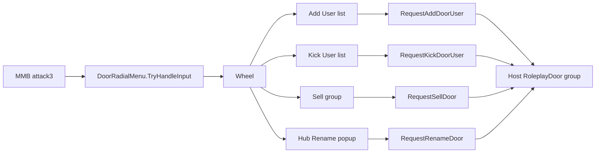

# S&Box Door Groups & Radial Menu

Owner-only middle-click wheel on purchased `RoleplayDoor`s. Map-linked groups
share buy/sell and users. Theme tokens: `$hud-panel-bg`, `$hud-outline`,
`$color-accent` from `Hud.scss` / `Theme.scss`.

## Product rules (do not break)

| Rule | Detail |
|------|--------|
| Open | Owner middle-clicks (`attack3` / `mouse3`) an owned, non-gov, non-public door. Radial only clears MMB when it handles a door; pocketables use MMB for inventory pickup |
| Wheel | **Add User**, **Kick User**, **Sell Door**; click hub title to **Rename** |
| Groups | Same non-empty `DoorGroupId` (case-insensitive, trimmed) = one group. Empty = standalone |
| Buy / sell | Whole group, **one** charge/refund = first door in stable `GameObject.Id` sort’s `PurchasePrice` |
| Door cap | Each **physical** door counts toward `RoleplayDoor.MaxOwnedPerPlayer` (6) |
| Users | Shared on the group. Owner add/kick only. Cap **8** (`MaxAllowedUsers`) |
| Title | Owner sets `_customTitle` (max 32). Hub + tooltips prefer it over mapper `DoorGroupTitle`. Cleared on sell / disconnect refund. Look tooltip shows name as out-of-flow subtitle only (unnamed doors stay clear) |
| Added user | Lock/unlock **looked door** and open when locked. **Cannot** sell / add / kick / rename |
| Lock state | Per-door (keys). Ownership + users are group-wide |
| Close | Escape/`cancel`, second MMB, click backdrop, Sell, death, lost ownership, spawn/inspect open |
| Disconnect | Host refunds each owned group once **before** `SaveRoleplayData`, then clears owner + users. Also strip that Guid from doors they were only a user on |
| Gov / public | No buy, no radial |

## Key files

| Area | Path |
|------|------|
| Door data / groups / users | `DarkRP2/Code/Map/RoleplayDoor.cs` |
| Input + host RPCs | `DarkRP2/Code/Player/Player.Doors.cs` |
| `OnControl` hook | `DarkRP2/Code/Player/Player.cs` → `HandleDoorRadialInput` |
| Radial HUD | `DarkRP2/Code/UI/Door/DoorRadialMenu.razor` (+ `.scss`) |
| Rename popup | `DarkRP2/Code/UI/Controls/StringQueryPopup.razor` — shared dialog; door rename uses it |
| Door look tooltip | `DarkRP2/Code/UI/Pressable/PressableHud.razor` — hide while the wheel is open |
| Tooltip chrome | `DarkRP2/Code/UI/Pressable/PressableTooltip.razor` (+ `.scss`) — 512×512 box; named-door subtitle |
| HUD mount | `DarkRP2/Assets/scenes/system.scene` (child of Hud `ScreenPanel`, next to LockpickIndicator) |
| ToolAuto / MMB | `DarkRP2/Code/Weapons/ToolGun/ToolAuto.cs` |
| Disconnect refund | `DarkRP2/Code/GameLoop/GameManager.cs` `OnDisconnected` |
| Spawnable copy | `DarkRP2/Assets/entities/door/roleplay_door.sent` |

## Architecture



- Pin the `RoleplayDoor` when the wheel opens — do not re-trace for add/kick/sell/rename.
- Host RPCs take the **door `GameObject` + target `Guid`** (or title string for rename). Validate `Rpc.Caller == Network.Owner`.
- Allowed users sync as a **comma-separated Guid string** (`[Sync(SyncFlags.FromHost)]`). Do not invent a `List<Guid>` sync.
- Custom title syncs as `_customTitle` (`[Sync(SyncFlags.FromHost)]`). Mapper `DoorGroupTitle` stays intact; sell clears only `_customTitle`.

## Radial HUD (required — silent-fail pitfall)

S&Box `PanelComponent` **must always emit `<root>`**. Returning before `<root>` when closed means `OnStart` never runs, the static instance stays null, and `Open()` is a no-op (MMB looks broken).

```razor
<root class="@(_isOpen ? "is-open" : "is-closed")">
    @if ( _isOpen )
    {
        <!-- backdrop + wheel / user list -->
    }
</root>
```

- Closed: `display: none; pointer-events: none` on the host. Open: flex overlay, `z-index: 1100` (must beat `PressableHud` at `1000`).
- Root `pointer-events: none`; backdrop + wheel + hub `pointer-events: all`.
- Hub click opens `StringQueryPopup` rename (closes the wheel first; pin `GameObject` for `RequestRenameDoor`).
- Rename dialog buttons: **Cancel** left, **Rename** (confirm) right — order is in `StringQueryPopup` (`Cancel` then `ConfirmLabel`). Do not put confirm first.
- Resolve the instance: static `_current`, then `Scene.Get<DoorRadialMenu>()`, then `GetAllComponents`, then `GetOrAddComponent` on `PressableHud` / `SpawnMenuHost` / `Notices`.
- Handle MMB in **both** `Player.HandleDoorRadialInput` and `DoorRadialMenu.OnUpdate` via `TryHandleInput`, with a short `TimeSince` lock so they do not open-then-close the same click.
- Accept `Input.Pressed("attack3")` **or** `"mouse3"` / `"Mouse3"`; `Input.Clear` all three after consume.
- Call `StateHasChanged()` on open/close. Do not close in `CanRemainOpen` for the first ~0.1s after open.
- `BuildHash` must include `_isOpen`, mode, door id, allowed-user string, and `Connection.All.Count`.
- Icons: Material Icons (`person_add`, `person_remove`, `sell`).
- Add User: `Connection.All` except owner and existing users. Kick: stored Guids (name from `PlayerData` / connection). Empty states required.
- Non-owner MMB on a buyable/owned door: notice (`Buy this door first.` / `Only the door owner can manage it.`). Silent if not looking at a roleplay door.
- `PressableHud.GetHovered()` must `return default` while `DoorRadialMenu.IsOpen`. Otherwise lock / Open / “Press MMB to Manage” stacks on the hub (`Openen`, `dooror`).
- Owner / allowed-user look tooltip (`RoleplayDoor.BuildTooltip` → `PressableTooltip`):
  - Action title is only `Open` / `Close` / `Locked` (same slot + `margin-bottom: 80px` whether named or not).
  - Door name (custom title / group label): `RoleplayDoor` still passes `title\n{name}`; `PressableTooltip` splits on `\n` into `.title` + `.subtitle`. **Do not** put the name on a second flowing title line — that shifts Open / crosshair / prompt vs unnamed doors.
  - `.subtitle` is `position: absolute` (`top: 212px`, full width, same font as title) so it sits in the Open→crosshair gap **out of flow**. Unnamed doors omit it entirely (no empty name label).
  - Description for owners is only `Press MMB to Manage` (no keys / price text). Allowed users: `Use keys`.
  - Keep the stock 512×512 `.tt` box (`position: absolute; width/height: 512px` only — no fullscreen / above-below flex split). That box is what keeps icon + Open above the crosshair and the prompt below.

## Wheel layout (do not regress)

One 420px disc (`border-radius: 210px`, `$hud-panel-bg`). Raised hub in the center (door title + Rename hint; clickable). Three actions sit **on the disc**, not as separate circular chrome buttons. Sell Door shows `$price` under its label.

| Slice | Angle | Icon center (420px wheel) | `left` / `top` of 108px slice |
|-------|-------|---------------------------|-------------------------------|
| Add User | 12 o’clock (0°) | (210, 76) | `156px` / `22px` |
| Kick User | 4 o’clock (120°) | (326, 277) | `272px` / `223px` |
| Sell Door | 8 o’clock (240°) | (94, 277) | `40px` / `223px` |

Divider spokes at **60° / 180° / 300°** (`left: 50%; height: 50%; transform-origin: 50% 100%` — must stay centered; fixed px offsets skew the three wedges). Hub is absolute-centered too (`left/top: 50%; margin -62px`).

Hit / hover uses angle-from-center on the wheel panel (`ResolveHotSlice`: `disc.MousePosition` vs `Box.Rect.Size`, not `Mouse.Position * ScaleFromScreen`). Add = 300–60°, Kick = 60–180°, Sell = 180–300°; ignore hub + outside the disc. Icons stay **absolute siblings** with pixel `left` / `top` and `pointer-events: none`.

**Do not** nest icons inside shaped panels — children ignore the shape and stack in the 420px box, so the wheel collapses to a dark circle. Prefer `border-radius` over `border-shape` on the disc and hub.

### Hover wash (required — do not regress)

Three **static** equal wedges — no textures, no CSS rotate on the fill:

```razor
<div class="wedge add @WashHot( "add" )"><div class="wedge-fill"></div></div>
<div class="wedge kick @WashHot( "kick" )"><div class="wedge-fill"></div></div>
<div class="wedge sell @WashHot( "sell" )"><div class="wedge-fill"></div></div>
```

| Piece | Role |
|-------|------|
| `.wedge` | Circular clip host (`overflow: hidden`); opacity 0→1 when `.is-hot` |
| `.wedge-fill` | 2× panel (`left/top: -50%`) with a fixed `border-shape` triangle |

Outer verts at r=50% of the 2× box on the spoke angles (north-CW: `x = 50 + 50·sin θ`, `y = 50 − 50·cos θ`):

| Slice | Spoke angles | `border-shape` chord |
|-------|--------------|----------------------|
| add | 300° → 60° | `50% 50%, 6.6987% 25%, 93.3013% 25%` |
| kick | 60° → 180° | `50% 50%, 93.3013% 25%, 50% 100%` |
| sell | 180° → 300° | `50% 50%, 50% 100%, 6.6987% 25%` |

Host circle clips a smooth outer arc; hub (`z-index: 3`) covers the tip. Spokes at `z-index: 2` cover the chord seams.

#### Wedge pitfalls (learned the hard way)

| Don’t | Why |
|-------|-----|
| Procedural wash textures + CSS/pixel rotate | Gaps, 1px pivot drift, unequal arcs |
| CSS half-disc + mask / orient nudges | Never stays flush; translucent mask leaks; nudges overcorrect |
| One fill + `rotate(0/120/240)` | Filter drift vs spokes |
| Overflow arms + `rotate(-120)` fill | Wash disappears |
| Conic-gradient | Soft bleed across spokes |
| `left: 208px` spoke pivot | Off-center vs bordered 420px disc — skews all three wedges |

Keep **three static `border-shape` pies on a 2× fill**, centered spokes/hub.

## ToolAuto

`ToolAutoSystem` also reads `attack3`. Skip `ToolAuto.Run()` when:

- `DoorRadialMenu.IsOpen`, or
- local player is **not** holding the toolgun, or
- `player.CanOpenDoorRadial` (owned door — radial consumes the click)

Holding toolgun + looking at **your** door → wheel, not tool cycle.

## Door / group API (host)

| Method | Purpose |
|--------|---------|
| `GetGroupDoors()` | This door, or all with the same `DoorGroupId` |
| `GetGroupPurchasePrice()` | Stable first door’s `PurchasePrice` |
| `TryBuy` / `TrySell` | Whole group; sell clears users + `_customTitle`, closes/unlocks all |
| `TrySetCustomTitle` | Owner only; writes the same title on every grouped door (max 32) |
| `GetHubTitle` | `_customTitle` → `DoorGroupTitle` → `"Door"` / `"N Doors"` |
| `TrySetLocked` | Owner **or** allowed user; **looked door only** |
| `TryAddUser` / `TryRemoveUser` | Owner only; write the same user list on every grouped door |
| `CanManageUsers` | Owner only (also `Connection.Local` for the local pawn) |
| `CanControlLock` | Owner or allowed user (gov/public unchanged) |
| `CanUseDoor` | If locked: owner or allowed user (not the old “locked = nobody”) |
| `ReleaseOwnershipFor` | Disconnect: refund unique groups, clear owner/users |

`IsOwned` is `_ownerId != Guid.Empty` (Guid compare), not “connection still in `Connection.All`”.

Player RPCs: `RequestAddDoorUser`, `RequestKickDoorUser`, `RequestSellDoor`, `RequestRenameDoor` (menu only — no R / look-based sell).

## Mapper notes

- Set matching `DoorGroupId` on every linked door (e.g. `apartment_12`).
- Optional `DoorGroupTitle` for tooltip + wheel hub.
- Put the group price on the doors; charge uses the lowest `GameObject.Id` in the group.
- No in-game “link these doors” tool.

## Checklist for changes

- [ ] `<root>` always exists (never `return` before root when closed)
- [ ] Instance resolve + `GetOrAdd` fallback still present
- [ ] MMB works with and without toolgun on an **owned** door
- [ ] ToolAuto does not steal owned-door `attack3`
- [ ] Add/Kick/Sell/Rename RPCs use the pinned door object (no re-trace)
- [ ] Users + buy/sell/rename apply to the whole `DoorGroupId` set
- [ ] Sell / disconnect clears `_customTitle` so hub shows Door again
- [ ] Allowed users can key the looked door; cannot sell/manage/rename
- [ ] Hub is clickable (`pointer-events: all`); slice hit-test still ignores hub radius
- [ ] Rename popup: Cancel left, Rename/confirm right (`StringQueryPopup`)
- [ ] Disconnect refunds once per group before save
- [ ] Panel still registered under Hud in `system.scene`
- [ ] Wheel is one disc: hub + 3 on-disc icons at 12 / 4 / 8 + spokes; hover wash = three static 2× `border-shape` wedges (add/kick/sell), no textures / CSS rotate on the fill
- [ ] Pressable tooltip hidden while `DoorRadialMenu.IsOpen`; menu `z-index` ≥ 1100
- [ ] Named vs unnamed owned-door tooltips: Open / icon / crosshair / “Press MMB to Manage” stay aligned; name is absolute subtitle only (no layout shift); unnamed doors show no name line
- [ ] Restart the session if a new HUD `PanelComponent` was added and hotload missed it
